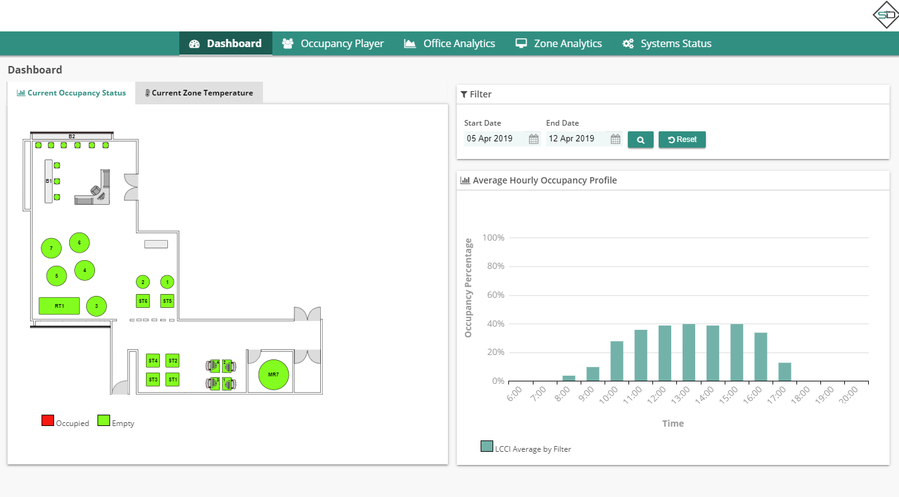
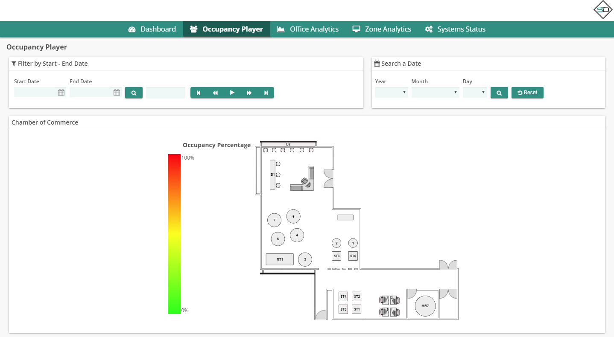
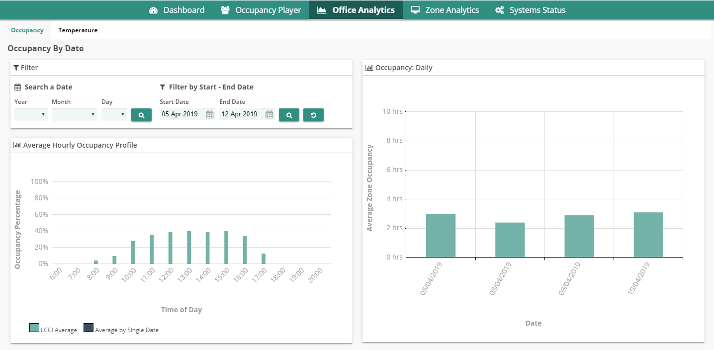
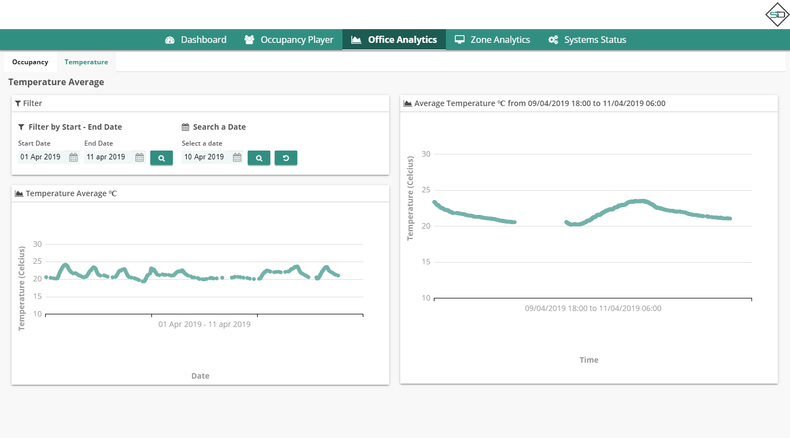
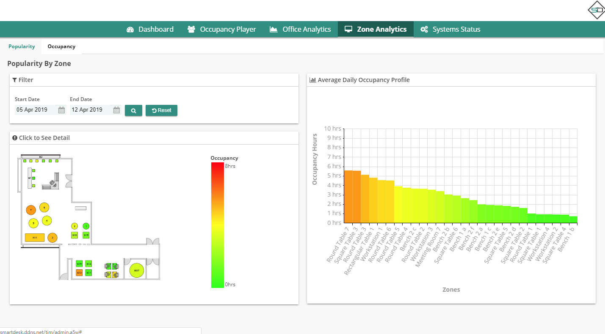
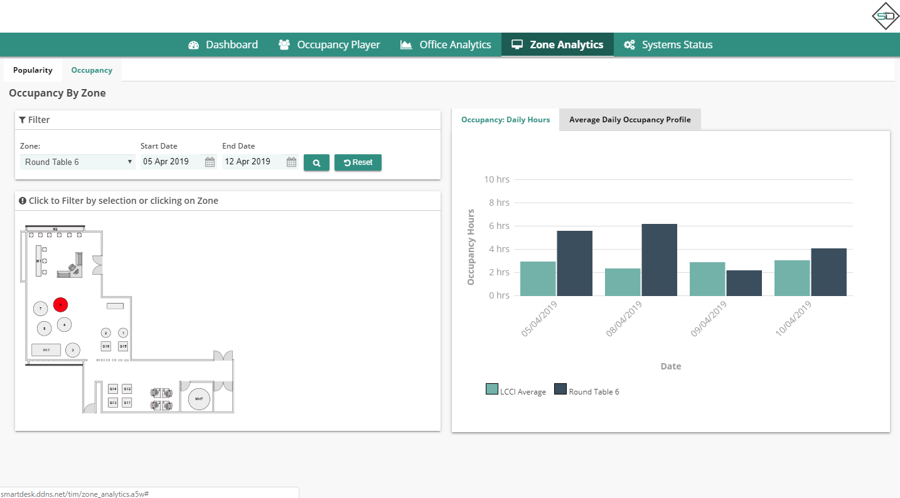
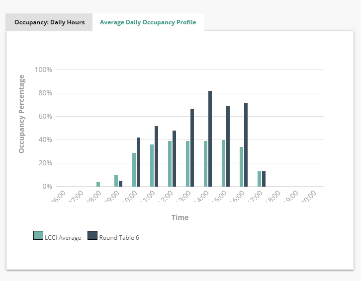
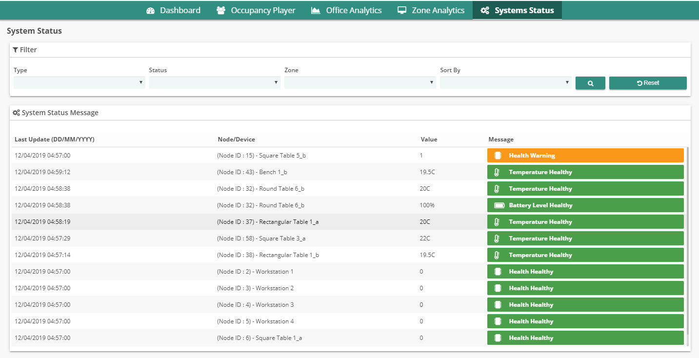

# User Manual

## Dashboard
 
### Current Occupancy Status 
Display Occupancy status Live Data  

1. red: occupied
2. green: empty

### Current Zone Temperature 
Display Temperature status Live Data

1. red
2. orange
3. yellow
4. green

### Average Hourly Occupancy Profile 

>:bulb:Noted: 
Automatically refresh each 2 minutes 
The refresh running forever as you see this page 

#####To Display Average Hourly Occupancy Profile
1. Select Start Date
2. Select End Date
3. Click Search Icon
---	
## Occupancy Player 

#####To Use Occupancy Player
1. Select Start date
2. Select end date
3. Click search icon
4. Pres play button  

#####To Search a Date
1. Select Year from dropdown
2. Select Month
3. Select Day
4. Click Search Icon 
---

## Office Analytics

###Occupancy

####Average Hourly Occupancy Profile 
Display average coccupancy of the desk for specific date

#####To display Average Hourly Occupancy Profile
1. Select Year
2. Select Month
3. Select Day
4. Click search icon

####Occupancy: Daily 
Display average coccupancy Daily

#####To display Occupancy Daily
1. Select Start Date
2. Select End Date
3. Click search icon

###Temperature

####Temperature Average between two dates 
To Display average coccupancy of the desk between two dates

1. Select Start Date
2. Select End Date
3. Click search icon

####Average Temperature specific date
To Display average coccupancy specific date in hourly range

1. Select Year
2. Select Month
3. Select Day
4. Click search icon

---
## Zone Analytics

### Popularity by zone 

To Display Popularity by zone

1. Select Start Date
2. Select End Date
3. Click Search Icon

### Average Daily Occupancy Profile

To Display Average Daily Occupancy Profile

1. Click zone in the picture
2. Select Start Date
3. Select End Date
4. Click Search Icon
---
## System Status 

#####To Do Filter
1. Select type
2. Select status
3. Select zone
4. Select Sort by
5. Click Search Icon

>:bulb: 
* Initially/after reset/after refresh it will only display 12 records 
* Click More Records button to load more data 
* Click Reset button to reset order by Status, Lastupdate 
* Automatically refresh each 2 minutes
---

